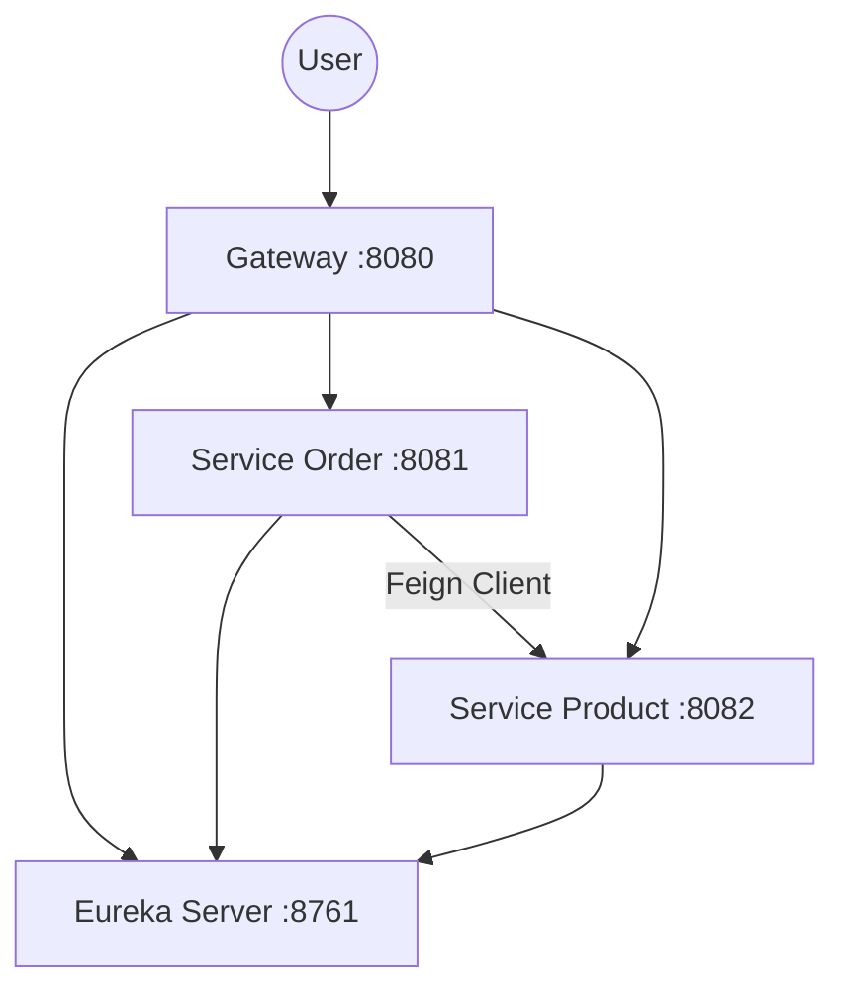

# Spring Cloud Lab 项目运行文档

本项目是一个最小化的 Spring Cloud 学习示例，包含注册中心、网关和两个微服务。

## 1. 项目架构



| 服务名称 | 端口 | 说明 |
| --- | --- | --- |
| `eureka-server` | 8761 | 服务注册中心 |
| `gateway` | 8080 | 网关，统一入口 |
| `service-order` | 8081 | 订单服务（模拟） |
| `service-product` | 8082 | 商品服务（模拟） |

## 2. 环境要求

- **JDK**: 17 或更高版本
- **Maven**: 3.6 或更高版本

## 3. 本地构建与运行

### 3.1 构建项目

在项目根目录下执行：

```bash
mvn clean package -DskipTests
```

### 3.2 启动顺序

请务必按照以下顺序启动服务，以确保服务能正确注册：

1.  **Eureka Server** (必须最先启动)
2.  **Service Order** & **Service Product**
3.  **Gateway**

### 3.3 启动方式

#### 方式一：使用 Maven 插件启动（开发推荐）

打开 4 个终端窗口，分别执行：

```bash
# 终端 1
mvn -pl eureka-server spring-boot:run

# 终端 2 (等待 Eureka 启动完毕后)
mvn -pl service-order spring-boot:run

# 终端 3
mvn -pl service-product spring-boot:run

# 终端 4
mvn -pl gateway spring-boot:run
```

#### 方式二：使用便利脚本

项目根目录提供了 `run_local.sh` 脚本（需先赋予执行权限 `chmod +x run_local.sh`），可一键后台启动所有服务：

```bash
./run_local.sh start
```

停止所有服务：

```bash
./run_local.sh stop
```

## 4. 线上部署

生产环境建议打包成 Jar 包运行，或构建 Docker 镜像。

### 4.1 Jar 包运行

1.  **打包**：
    ```bash
    mvn clean package -DskipTests
    ```
    构建完成后，在各子模块的 `target` 目录下会生成 `.jar` 文件。

2.  **启动命令**：

    ```bash
    # 启动 Eureka
    nohup java -jar eureka-server/target/eureka-server-0.0.1-SNAPSHOT.jar > eureka.log 2>&1 &

    # 启动服务 (建议指定堆内存大小)
    nohup java -jar -Xmx512m service-order/target/service-order-0.0.1-SNAPSHOT.jar > order.log 2>&1 &
    nohup java -jar -Xmx512m service-product/target/service-product-0.0.1-SNAPSHOT.jar > product.log 2>&1 &

    # 启动网关
    nohup java -jar -Xmx512m gateway/target/gateway-0.0.1-SNAPSHOT.jar > gateway.log 2>&1 &
    ```

### 4.2 部署注意事项
- 确保服务器防火墙开放了 8080 (网关) 和 8761 (Eureka) 端口（如果需要外部访问 Eureka 面板）。
- 内部服务端口 (8081, 8082) 建议通过防火墙隔离，仅允许网关访问。

## 5. 访问验证

### 5.1 查看注册中心

访问浏览器：[http://localhost:8761](http://localhost:8761)
应看到 `SERVICE-ORDER`, `SERVICE-PRODUCT`, `GATEWAY` 均已注册并在 UP 状态。

### 5.2 接口测试

**网关统一入口访问 (推荐)**：

| 描述 | 方法 | URL | 预期结果 |
| --- | --- | --- | --- |
| 订单服务 Ping | GET | `http://localhost:8080/order/orders/ping` | `{"service":"service-order","status":"ok"}` |
| 获取订单详情 | GET | `http://localhost:8080/order/orders/1` | 返回订单信息，并包含**远程调用 Product 服务**获取的商品详情 |
| 商品服务 Ping | GET | `http://localhost:8080/product/products/ping` | `{"service":"service-product","status":"ok"}` |
| 获取商品详情 | GET | `http://localhost:8080/product/products/2` | 返回 ID 为 2 的商品 JSON |

**Curl 测试命令**：

```bash
# 测试订单服务路由
curl http://localhost:8080/order/orders/ping
curl http://localhost:8080/order/orders/100

# 测试商品服务路由
curl http://localhost:8080/product/products/ping
curl http://localhost:8080/product/products/200
```
